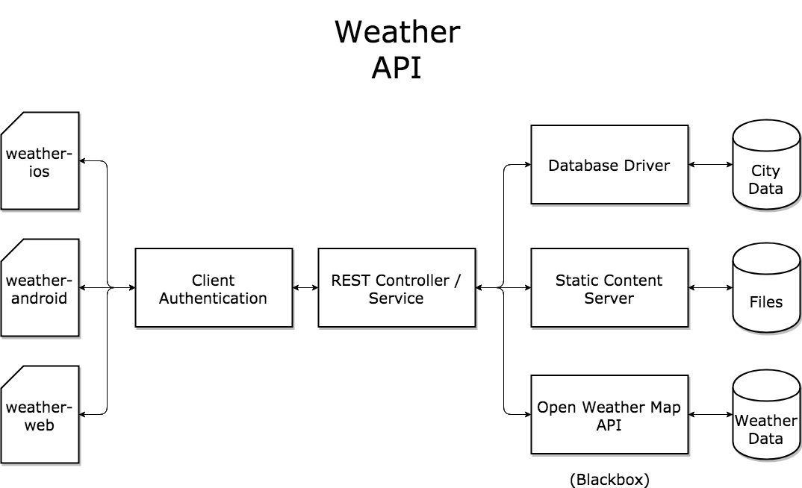

# Weather API
[](https://travis-ci.com/N02870941/weather-api)

Weather API is a wrapper around various [Open Weather Map][open-weather] APIs for supplying data to
[Weather for iOS][weather-ios], [Weather for Android][weather-android] and the [Weather web app](http://weather.jabaridash.com).

The application is structured as follows:

<p align="center">
  
</p>

# APIs
Two free 3rd-party public APIs are used to support this application

* [Open Weather Map Weather API][weather]
* [Open Weather Map 5 Day Forecast API][forecast]

REST endpoints:

* `/`
* `/img/w`
* `/search`
* `/weather`
* `/forecast`

## Notes
All API call examples assume the application is running on `localhost:8080`.

The following API call examples include the header `app-id:1`. This must
be replaced with the real `app-id` at runtime. For development, any value is fine,
as long as that header is manually set in each REST call. In production, this value
should match a cryptographic hash value that will be sent from the client applications
and for server-side verification.

# Static content
Any other path that is not a REST endpoint is treated as static content. For example:

```
curl -H "app-id:1" http://localhost:8080/photo/rainy.jpg
```

This would return the following photo:

<p align="center">
  
</p>

The endpoint can also be used to retrieve the homepage `index.html` using
one of the following commands:

```
curl -H "app-id:1" http://localhost:8080/index.html
```

In this special case, the file name can be omitted:

```
curl -H "app-id:1" http://localhost:8080/
```

# Icons
The `/img/w` endpoint is a wrapper around `http/openweathermap/img/w` for getting
icons. It is used as follows:

```
curl -H "app-id:1" http://localhost:8080/img/w/10d.png
```

This will return an icon that corresponds to the icon id `10d`. A full listing of
icon ids can be found at [the Open Weather Map website](https://openweathermap.org/weather-conditions).

# Search
The search endpoint exposes a simple searching mechanism for finding cities by
name. It is used as follows:

```
curl -H "app-id:1" http://localhost:8080/search?city=White%Plains
```

This will return a JSON array in the following format (formatted for visualization purposes):

```
[
    {
        "id": 5144336,
        "name": "White Plains",
        "country": "US",
        "lat": 41.033989,
        "lon": -73.762909
    },
    {
        "id": 4498720,
        "name": "White Plains",
        "country": "US",
        "lat": 35.23402,
        "lon": -81.39814
    },
    {
        "id": 4498722,
        "name": "White Plains",
        "country": "US",
        "lat": 36.44569,
        "lon": -80.6334
    }
]
```

The JSON can then be used on the client to make subsequent REST calls
by latitude and longitude, or by city-id to get more accurate weather data.

# Current weather
The `/weather` endpoint exposes the [Open Weather Map Current Weather API](https://openweathermap.org/current).
This returns the most current report on the queried location(s). It is used as follows:

```
curl -H "app-id:1" http://localhost:8080/weather?q=Chicago,us
```

A JSON object that appears as follows should be returned (formatted for visualization purposes):

```
{
    "coord": {
        "lon": -87.62,
        "lat": 41.88
    },
    "weather": [
        {
            "id": 701,
            "main": "Mist",
            "description": "mist",
            "icon": "50d"
        }
    ],
    "base": "stations",
    "main": {
        "temp": 296.7,
        "pressure": 1024,
        "humidity": 100,
        "temp_min": 296.15,
        "temp_max": 297.15
    },
    "visibility": 16093,
    "wind": {
        "speed": 2.47,
        "deg": 267.505
    },
    "clouds": {
        "all": 40
    },
    "dt": 1530791100,
    "sys": {
        "type": 1,
        "id": 1030,
        "message": 0.0038,
        "country": "US",
        "sunrise": 1530786103,
        "sunset": 1530840504
    },
    "id": 4887398,
    "name": "Chicago",
    "cod": 200
}
```

# Five day forecast
The five day forecast is accessible via the endpoint `/forecast`. It is a wrapper
around the [Open Weather Map 5 Day Forecast API](https://openweathermap.org/forecast5).
It can be consumed as follows:

```
curl -H "app-id:1" http://localhost:8080/forecast?q=Chicago,us
```

Your result should appear as follows (formatted for visualization purposes):

```
{
    "cod": "200",
    "message": 0.0048,
    "cnt": 40,
    "list": [
        {
            "dt": 1530802800,
            "main": {
                "temp": 295.02,
                "temp_min": 294.578,
                "temp_max": 295.02,
                "pressure": 1016.16,
                "sea_level": 1037.91,
                "grnd_level": 1016.16,
                "humidity": 89,
                "temp_kf": 0.44
            },
            "weather": [
                {
                    "id": 501,
                    "main": "Rain",
                    "description": "moderate rain",
                    "icon": "10d"
                }
            ],
            "clouds": {
                "all": 32
            },
            "wind": {
                "speed": 1.52,
                "deg": 293
            },
            "rain": {
                "3h": 5.7
            },
            "sys": {
                "pod": "d"
            },
            "dt_txt": "2018-07-05 15:00:00"
        },
        .
        .
        .
    ]
}
```

*NOTE: The JSON array* `list` *has been truncated for the sake of brevity.*

# Environment variables
The API uses several environment variables that need to be available at runtime.

## Required environment variables
The following environment variables must be set on the host. If not, the
application will not start.

### `IOS_APP_ID`
A hash value unique to the iOS application. It will be send in the header
of every HTTP request send from the iOS mobile application.

### `ANDROID_APP_ID`
A hash value unique to the android application. It will be send in the header
of every HTTP request send from the android mobile application.

### `OPEN_WEATHER_API_KEY`
The Open Weather Map API used to make calls to the weather and forecast APIs. This
must be a valid API key, otherwise the application still will not start - despite
the environment variable being set.

## Optional environment variables
The following do not have to be set, but can be set to tweak the behavior of
the application.

### `WEATHER_API_PORT`
When running with docker, we do not need to specify the `WEATHER_API_PORT`
environment variable because it is specified in the
[`Dockerfile`](https://github.com/N02870941/weather-api/blob/master/Dockerfile). If the variable is
not set, the application defaults to port 80. This environment variable is simply a convenience feature for
development in the event that the port 80 is not accessible.

### `RESPONSE_TIME_LIMIT`
The time limit in milliseconds a request has to complete. Otherwise a generic timeout response
will be sent to the user. This is to avoid blocking of I/O and stalling HTTP request.
If the variable is not set, the timeout is set to the Express default value of 120000
milliseconds (2 minutes).

If a request times out, the following HTTP response body will be returned with code 503 (`SERVICE_UNAVAILABLE`):

```
{
    "message": "Request timed out. Try again later."
}
```

## Other managed environment variables
The following are environment variables that are managed by the application
and should **NOT** be manipulated.

### DB_READY
A boolean value that lets the application know that the internal SQLite3 database is
ready to be accessed. If this variable is set to any value other than `true`, then HTTP
calls will result in a response with HTTP code 503 (`SERVICE_UNAVAILABLE`)
and the following response body:

```
{
    "message": "Internal database not ready yet. Try again later."
}
```

# Running the app
You can run the app from source or as a docker container.

## Running with Docker
You may run the API on a docker host in several ways.

### Running with `docker run` command
Assuming `docker` is installed, execute the following:

```
docker run                            \
-p 8080:80                            \
--env IOS_APP_ID=0                    \
--env ANDROID_APP_ID=1                \
--env OPEN_WEATHER_API_KEY=replaceme  \
jabaridash/weather-api
```

### Running with `docker-compose` command
Assuming `docker-compose` is installed, do the following:

Download the [`docker-compose.yml`](https://github.com/N02870941/weather-api/blob/master/docker-compose.yml) file:

```
curl https://raw.githubusercontent.com/N02870941/weather-api/master/docker-compose.yml > docker-compose.yml
```

In the `docker-compose.yml`, Replace the `replaceme` with a real Open Weather Map API key, and set other environment variables:

```
environment:
 - IOS_APP_ID=0
 - ANDROID_APP_ID=1
 - OPEN_WEATHER_API_KEY=replaceme
```

Then run the following command:

```
docker-compose up
```

### Running in swarm mode
Assuming you are running this container on a docker swarm Node with manager
status, execute the following:

```
docker service create                  \
--name weather-api                     \
--mode global                          \
--publish 8080:80                      \
--env IOS_APP_ID=0                     \
--env ANDROID_APP_ID=1                 \
--env OPEN_WEATHER_API_KEY=replaceme   \
jabaridash/weather-api
```

## Running from source
Assuming [Node 8.7.0+](https://nodejs.org/en/blog/release/v8.7.0/) is installed, execute the following:

```bash

# Declare environment variables
export WEATHER_API_PORT=8080
export IOS_APP_ID=0       
export ANDROID_APP_ID=1       
export OPEN_WEATHER_API_KEY=replaceme  

# Run app
npm install
cd /src/js
node app.js
```

## Output
Your output should appear as follows:

```
API key is valid
Listening for connections on port 8080
```

You can then consume the API using commands similar to:

```
curl -H "app-id:1" http://localhost:8080/weather?q=Chicago,us
```

After starting the app and making 1 API call, the server log should appear as follows:

```
API key is valid
Listening for connections on port 8080
{ date: 2018-07-05T21:35:49.793Z,
  client_ip: '::1',
  method: 'GET',
  url: '/weather?q=Chicago,us',
  host: 'localhost:8080',
  agent: 'curl/7.54.0' }
Authenticating client
Client is authorized
HTTP GET - https://api.openweathermap.org/data/2.5/weather?APPID=<APIKEY>&q=Chicago,us
HTTP GET successful
```

And the client will get the following (formatted for visualization purposes):

```
{
    "coord": {
        "lon": -87.62,
        "lat": 41.88
    },
    "weather": [
        {
            "id": 211,
            "main": "Thunderstorm",
            "description": "thunderstorm",
            "icon": "11d"
        }
    ],
    "base": "stations",
    "main": {
        "temp": 298.5,
        "pressure": 1024,
        "humidity": 94,
        "temp_min": 295.15,
        "temp_max": 302.15
    },
    "visibility": 11265,
    "wind": {
        "speed": 3.6,
        "deg": 150
    },
    "clouds": {
        "all": 90
    },
    "dt": 1530825300,
    "sys": {
        "type": 1,
        "id": 966,
        "message": 0.0264,
        "country": "US",
        "sunrise": 1530786117,
        "sunset": 1530840497
    },
    "id": 4887398,
    "name": "Chicago",
    "cod": 200
}
```

At this point, the API is ready for consumption.

# Errors
Errors are handled in various ways. Fatal errors call for an immediate
termination of the process. A fatal error can be brought about in one of
the following ways:

* The supplied API key for Open Weather Map is invalid
* The host cannot properly communicate with the Open Weather Map API
* All required environment variables are not set properly
* The specified bind port is already in use or not a number
* Local SQLite 3 database cannot be written to or read properly
* Other uncaught errors are thrown but not accounted for in the code (bugs)

An example of the fatal error of not specifying the API key follows:  

Starting the application:

```
node app.js
```

Result:

```
Error: Could not establish successful connection with API. Please ensure that the environment variable "OPEN_WEATHER_API_KEY" is properly set to the Open Weather API key. API key: undefined. You may define it by running the following command in the terminal:

export OPEN_WEATHER_API_KEY=replaceme

Note: The above key must be replaced with your actual API key
    at Object.setup (/Users/jod/Code/weather-api/src/service.js:33:13)
    at Object.setup (/Users/jod/Code/weather-api/src/controller.js:57:19)
    at setup (/Users/jod/Code/weather-api/src/app.js:49:22)
    at Object.<anonymous> (/Users/jod/Code/weather-api/src/app.js:90:1)
    at Module._compile (module.js:624:30)
    at Object.Module._extensions..js (module.js:635:10)
    at Module.load (module.js:545:32)
    at tryModuleLoad (module.js:508:12)
    at Function.Module._load (module.js:500:3)
    at Function.Module.runMain (module.js:665:10)
```

Checking the exit status:

```
echo $?
```

Result:
```
200
```

A [comprehensive mapping of the fatal error codes](https://github.com/N02870941/weather-api/blob/master/src/resource/data/error.codes.json)
is available.

All other errors that are accounted for in the code will return a JSON or
HTML response body with an error message and the appropriate HTTP code. For example,
getting weather data from the `/weather` endpoint for a city that does not exist
in the database goes as follows:

API call:

```
curl -H "app-id:1" http://localhost:8080/weather?q=Gotham,dc
```

Result:

```
{
    "cod": "404",
    "message": "city not found"
}
```

# Notes
This documentation is also available [here](https://n02870941.github.io/weather-api/).

[open-weather]:    https://openweathermap.org
[weather]:         https://openweathermap.org/weather
[forecast]:        https://openweathermap.org/forecast
[weather-ios]:     https://github.com/N02870941/weather-ios
[weather-android]: https://github.com/N02870941/weather-android
